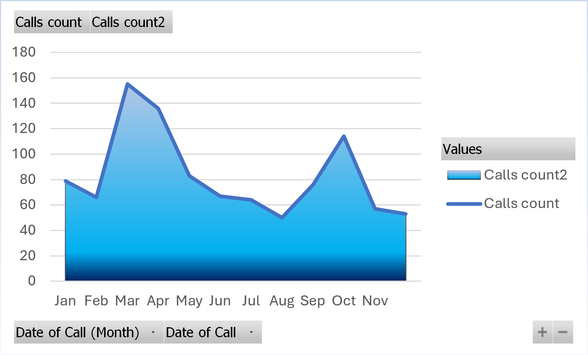
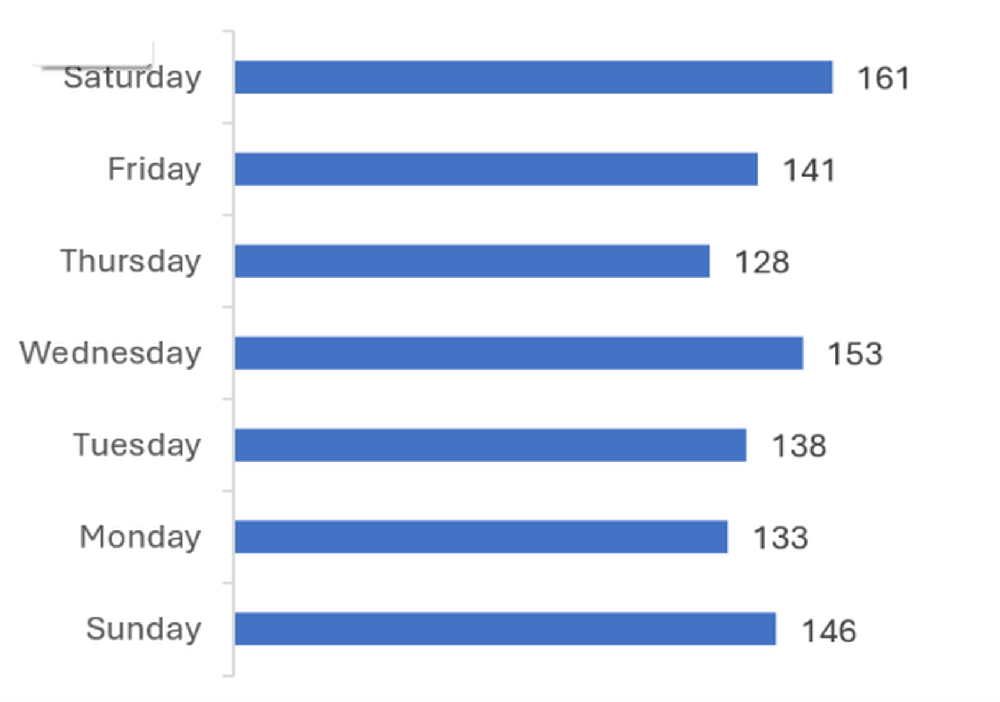
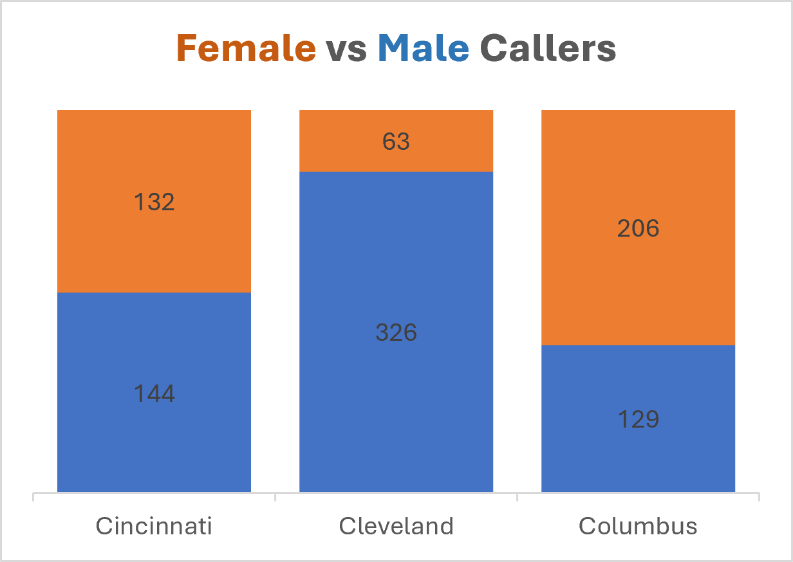
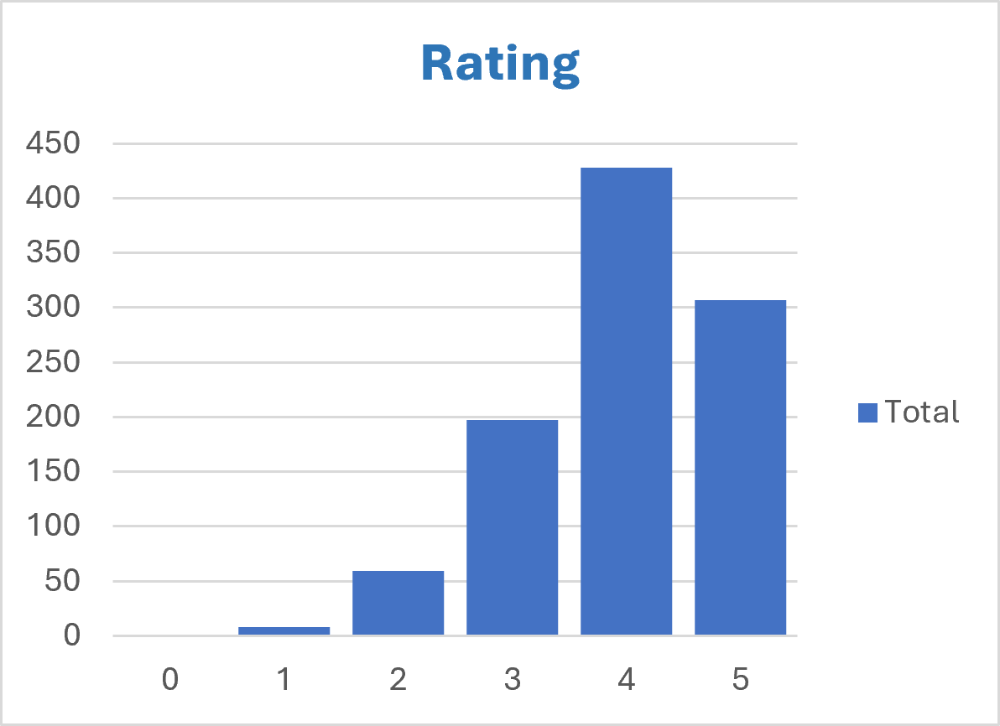
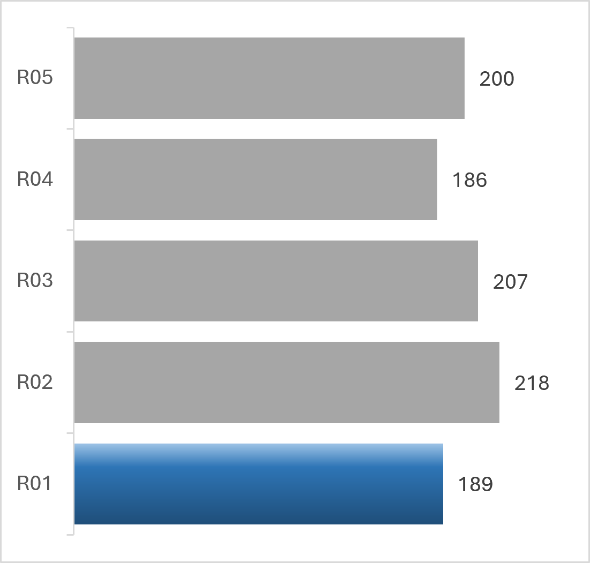
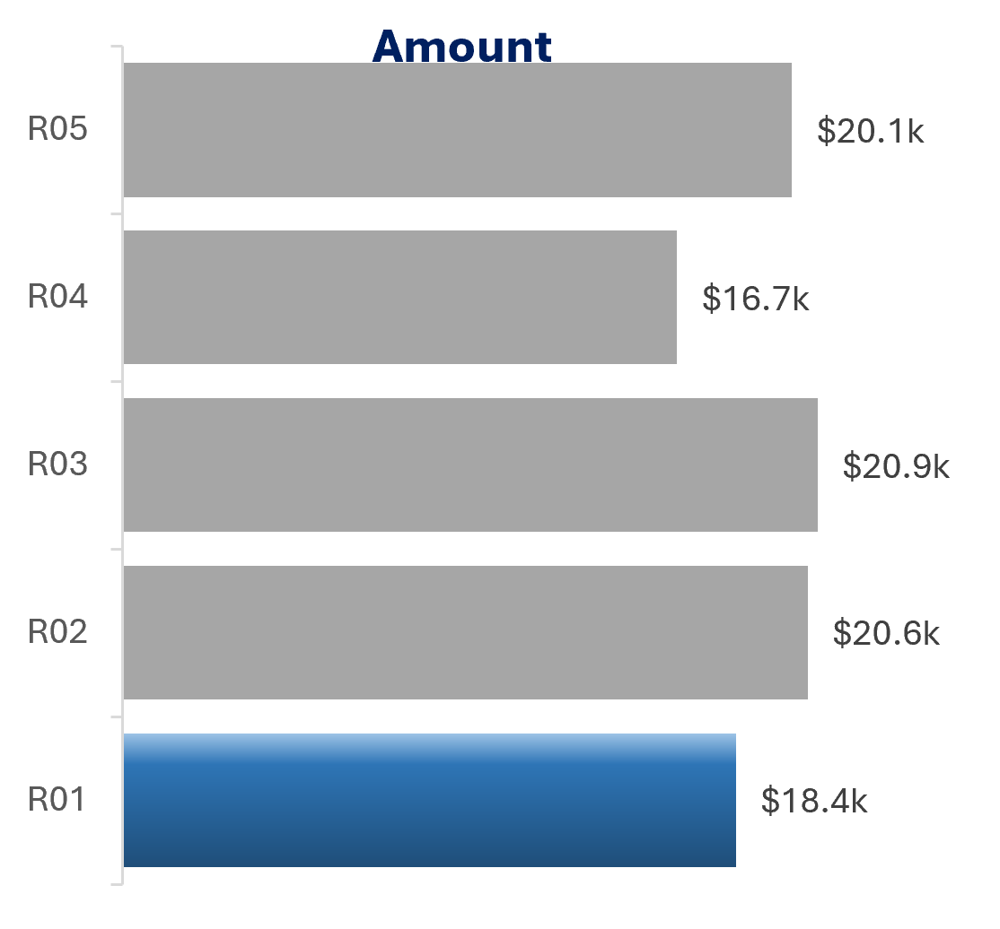
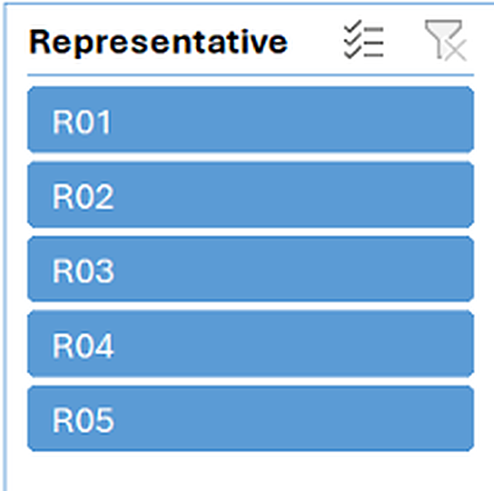
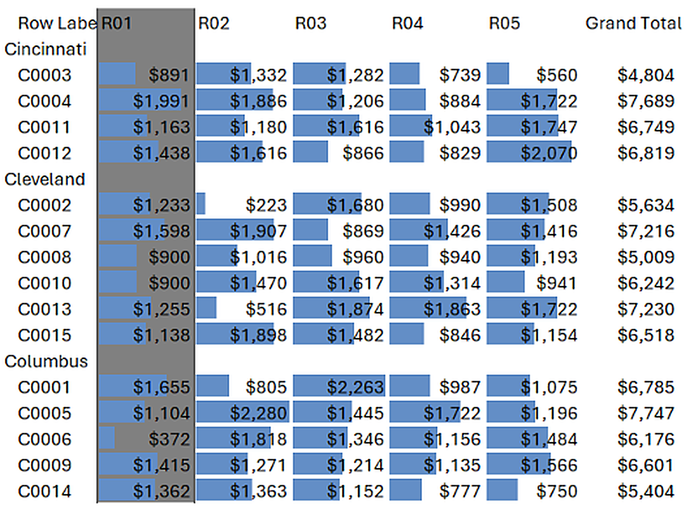

# Call Center Dashboard (Excel)

Interactive Excel dashboard built with Pivot Tables, Pivot Charts and a Representative slicer.

## Overall Dashboard

## Dashboard Preview

### KPIs

### Calls by Month

### Calls by Weekday

### Female vs Male Callers by City

### Rating Distribution

### Calls by Representative

### Amount by Representative

### Representative Slicer

### Customer Sales by Representative

## Key Insights
- 1,000 total calls, total amount ₹96,623
- Average rating 3.9, with 307 five-star calls
- Calls peak in March and October

## Tools Used
Excel, Pivot Tables, Pivot Charts, Slicers, Conditional Formatting

## How to Use
Download `Call-Center-Dashboard.xlsx`, open it in Excel and use the Representative slicer to filter every chart.
